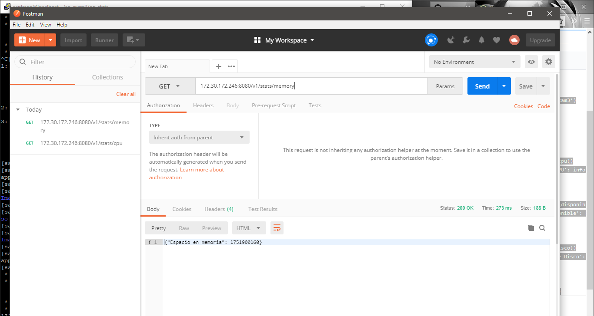

# so-exam3

**Nombre:** Santiago Fajardo Sima    
**Código:** A00328044    
**Materia:** Sistemas operacionales  
**Correo personal:** santiago_fajardo96@hotmail.com  
**URL repositorio:** https://github.com/santyfajardo/so-exam3.git  

### 3 Implementar un servicio web en Flask siguiendo la estructura definida en clase.  
1. Crear ambiente virtual santiago.  
2. Dos archivos con las dependencias necesarias. requirements_dev.txt y requirements.txt  
Esto nos permitira implementar el servicio web Flask.  
3. Crear carpeta op_stats con los archivos stats.py y app.py   

```
import psutil

class Stats():

  @classmethod
  def porcentaje_cpu(cls):
    porcentaje = psutil.cpu_percent()
    return porcentaje

  @classmethod
  def memoria_disponible(cls):
    ram = psutil.virtual_memory().available
    return ram

  @classmethod
  def espacio_disco(cls):
    espacio = psutil.disk_usage('/').free
return espacio .disk_usage('/').free
    return espacio_disponible
   ```    

```
from flask import Flask
import json
import sys
sys.path.append('/home/santiago/so-exam3')
from op_stats.stats import Stats

app = Flask(__name__)

@app.route('/v1/stats/cpu')
def cpu():
    info_cpu = Stats.porcentaje_cpu()
    return json.dumps({'CPU Porcentaje': info_cpu})

@app.route('/v1/stats/memory')
def memoria():
    info_memoria = Stats.memoria_disponible()
    return json.dumps({'Espacio en memoria': info_memoria})

@app.route('/v1/stats/disk')
def disco():
    info_disco = Stats.espacio_disco()
    return json.dumps({'Espacio en el Disco': info_disco})


if __name__ == '__main__':
app.run(host='0.0.0.0',port=8080)
   ```    
4. Ejecutar el comando ``python op_stats/app.py`` 
5. Hacer las pruebas con Postman

 

  

  

     

Se puede rectificar en el centos la solicitud:  

  

### 4 Implemente las pruebas unitarias para los servicios empleando Fixtures y Mocks como se vio en clase.  
1.Crear carpeta tests  
2.Crear archivos test_stats.py   
  
```
import pytest
import sys
sys.path.append('/home/santiago/so-exam3')

from op_stats.app import app
from op_stats.stats import Stats

@pytest.fixture
def client():
  client = app.test_client()
  return client

def test_get_cpu_percent(mocker, client):
  mocker.patch.object(Stats, 'porcentaje_cpu', return_value=50)
  response = client.get('/v1/stats/cpu')
  assert response.data.decode('utf-8') == '{"CPU Porcentaje": 50}'
  assert response.status_code == 200

def test_get_available_memory(mocker, client):
  mocker.patch.object(Stats, 'memoria_disponible', return_value=20)
  response = client.get('/v1/stats/memory')
  assert response.data.decode('utf-8') == '{"Espacio en memoria": 20}'
  assert response.status_code == 200


def test_get_disk_space(mocker, client):
  mocker.patch.object(Stats, 'espacio_disco', return_value=150)
  response = client.get('/v1/stats/disk')
  assert response.data.decode('utf-8') == '{"Espacio en el Disco": 150}'
assert response.status_code == 200
  ```  
3. Ejecutar ``pytest -v``
  


### 5 Emplee un servicio de integracíon continua que haga uso de las pruebas unitarias desarrolladas para validar sus commits.  
1. Crear archivo tox.ini  
 
```
[tox]
envlist = pytest 

[testenv]
basepython = python3

[testenv:pytest]
deps =
  -rrequirements_dev.txt
commands =
  pytest
  ```  
2. Ejecutar ``tox -e pytest``  
  
  

3.Crear archivo .travis.yml

```
sudo: false
language: python
notifications:
  email: false
python:
- '3.4'
install: pip install tox-travis
script: tox -e pytest
``` 
- Luego de que se ejecute ese archivo, obtenemos lo siguiente:  

  
  
  
  
  
